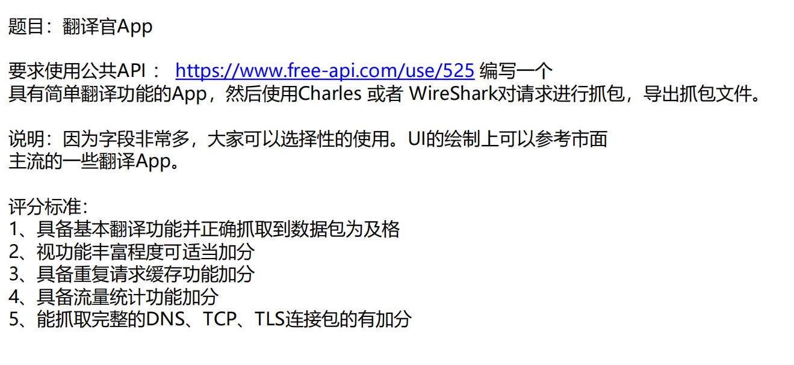
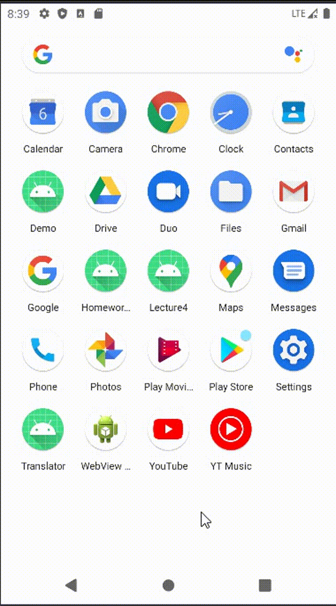

# Homework 5
#### 题目要求

#### 目录内容
- `app/src/main/java/com/crepuscule/jstu/homework5/jsonClass`
- `app/src/main/java/com/crepuscule/jstu/homework5/MainActivity`
- `src/main/res/layout/`

#### 实现效果

